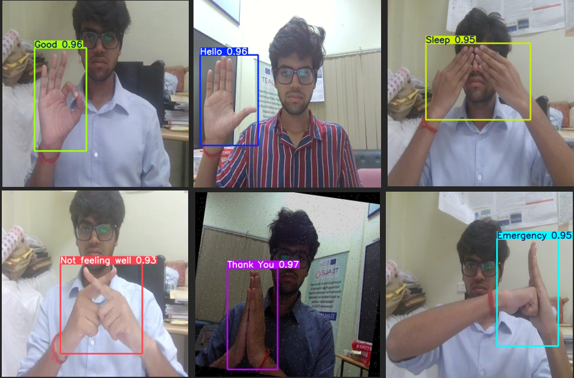
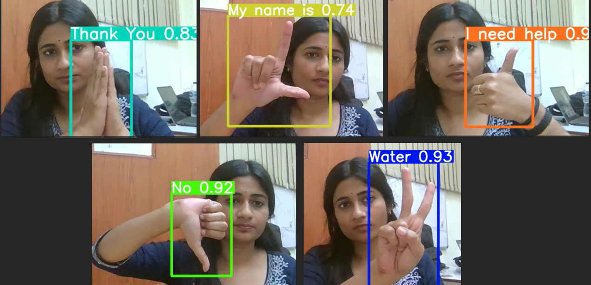
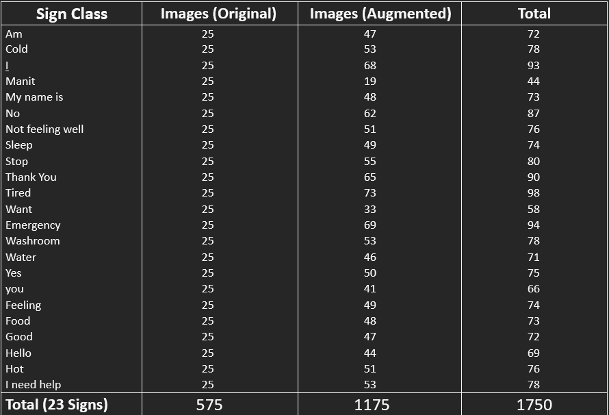
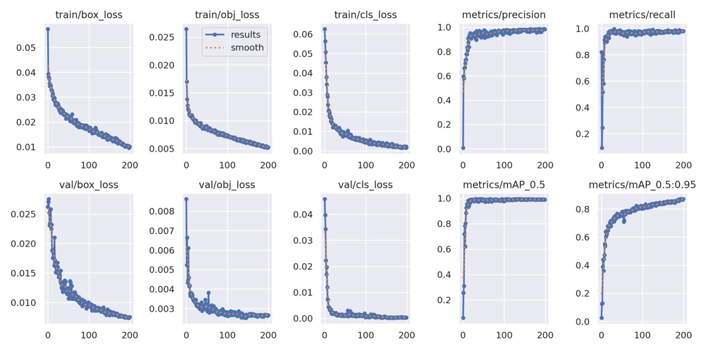
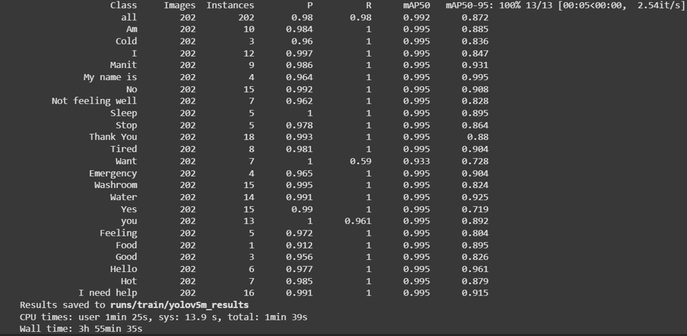

#  AI-Powered Real-Time Sign Language Interpreter

 
 
 
 

---

##  Breaking Communication Barriers with AI
An **AI-powered real-time interpreter** that recognizes **23 essential sign language gestures** with a **mAP@50 of 99.2%** and instantly converts them into **spoken words**.  
Designed to **assist individuals with speech or hearing disabilities**, enabling **seamless, natural conversations** through machine learning and text-to-speech technology.

---

##  Demo
 **[Watch Full Demo Video](https://youtu.be/lBeAlBZhJzk)** 

---

### Live Output Screenshots:

 

---

##  Dataset Summary Table:
   
  

  ---

##  Features & Achievements
-  **Real-Time Detection:** Powered by **YOLOv5 v7.0** for fast and accurate gesture recognition.  
-  **High Accuracy:** Achieved **99.2% mAP@50** across 23 distinct hand gestures.  
-  **Live TTS Output:** Converts detected gestures into **instant spoken audio** via `pyttsx3`.  
-  **Robust Dataset:** Custom dataset of **1800+ images**, enhanced using **Roboflow** for better class balance.  
-  **Optimized Training:** Trained on **CUDA-enabled GPUs**, ensuring high-speed inference and scalability.  
-  **Accessibility-Focused:** Aimed at **empowering speech and hearing-impaired communities** through AI.

---

##  How It Works
1. Capture real-time video feed.  
2. YOLOv5 model detects and classifies hand gestures.  
3. Detected gestures are mapped to corresponding words.  
4. Python **Text-to-Speech** engine converts recognized signs into live audio output.

---

## Tech Stack
- **Machine Learning:** YOLOv5 (v7.0), Roboflow  
- **Programming:** Python, OpenCV, threading  
- **Speech:** `pyttsx3` for TTS  
- **Tools:** LabelImg, Google Colab, CUDA GPU  
- **Visualization:** Matplotlib (for training graphs)

---

##  Dataset & Training
- **Images:** 1800+ labeled gesture images  
- **Classes:** 23 distinct sign language gestures  
- **Augmentations:** Applied via Roboflow to handle class imbalance  
- **Training Epochs:** 200  
- **Performance:** `mAP@50 = 99.2%`

---
## Training Graphs: 

 ### Training Metrics Graph 
 
 
 

### Per-Class Detection Performance
 

---
##  Results

- **Precision:** 98.7%  
- **Recall:** 99.0%  
- **mAP@50:** 99.2%  

---

##  Future Improvements
- Expand gesture dataset to include full ASL/ISL vocabulary.  
- Add **bi-directional translation** (Speech → Text → Gesture animation).  
- Deploy as a **mobile or web-based assistive tool** for broader access.

---
